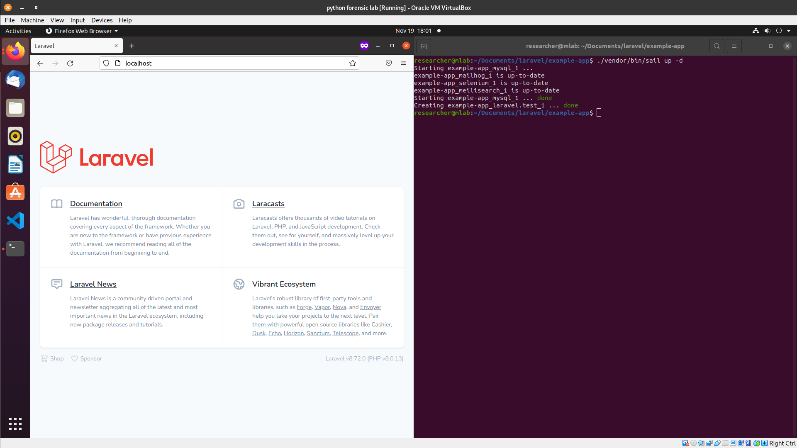

## Install Docker on Ubuntu Machine 
```
	curl -fsSL https://get.docker.com -o get-docker.sh
	sudo sh get-docker.sh

//use the following line of command in case it shows docker compose is unrecognized command in the following steps

	sudo curl -L "https://github.com/docker/compose/releases/download/1.29.2/docker-compose-$(uname -s)-$(uname -m)" -o /usr/local/bin/docker-compose   

```
[source](https://docs.docker.com/engine/install/ubuntu/)

## Laravel Installation using Docker 
```
usermod -aG docker $USER
docker run hello-world 

curl -s https://laravel.build/example-app | bash

cd example-app && ./vendor/bin/sail up   //if it works and you want to switch on the detached mode 

ctrl+C //to kill the current running process 

./vendor/bin/sail up -d
```
PoC Image



